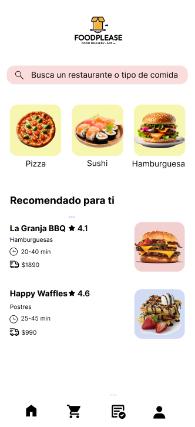
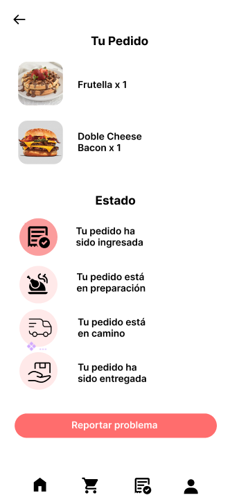
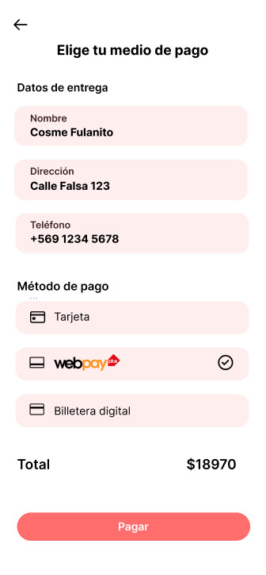

# FoodPlease - Aplicación móvil de Delivery
Proyecto académico diseñado para el curso Taller de desarrollo web y móvil

# Objetivos
- Diseñar mockups de las vistas principales del aplicativo móvil.  
- Proponer una arquitectura de integración web/móvil que asegure trazabilidad, pagos y geolocalización.  
- Documentar los avances en un repositorio público en GitHub, cumpliendo con los requerimientos de la evaluación.  

# Mockups
https://www.figma.com/design/P0jA7GuD94UIcIJmML0P1t/FoodPlease?node-id=0-1&t=GKQm4L4Gu4161DAS-1

- Inicio  
  

- Pedido  
  

- Pago  
  

# Propuesta de integración
*Web (Local gastronómico):
  - Gestión de menú, disponibilidad de productos y precios.
  - Recepción de pedidos en tiempo real.
  - Asignación de repartidores y visualización de métricas.

*App Móvil Cliente:
  - Explorar restaurantes, ver menú, agregar al carrito y pagar en línea.
  - Seguimiento del pedido y calificación del servicio.

*App Móvil Repartidor:
  - Aceptar pedidos dentro de su radio de entrega.
  - Navegación GPS integrada.
  - Confirmación de entrega con PIN/QR.
